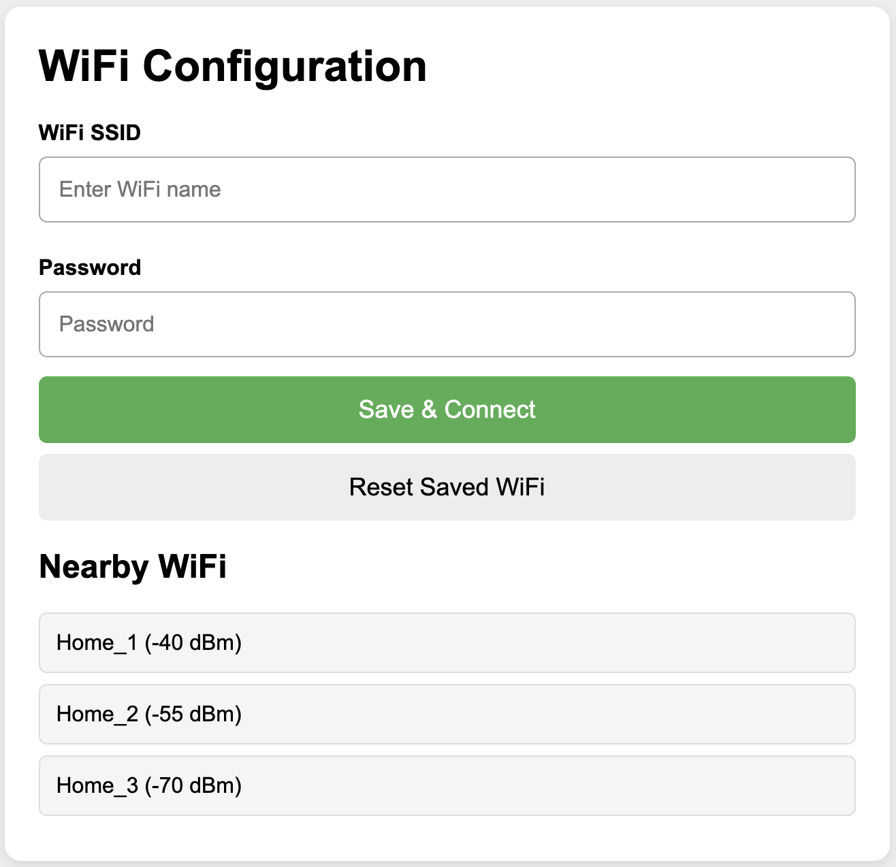

# ESP_WiFi_Manager



Simple WiFi manager for ESP8266 / ESP32.

Features:
- AP-based configuration portal (web UI) to select and save WiFi networks
- Stores credentials in Preferences (ESP32) / EEPROM-like API for ESP8266
- Connection state machine with retry and fallback to AP mode


## API Reference

| Function | Description |
|----------|-------------|
| `wifiManagerBegin()` | Initialize the WiFi manager. Call once in `setup()`. |
| `wifiManagerLoop()` | Main loop handler. Call in your `loop()`. |
| `setAPName(const String &ssid)` | Set the SSID for the configuration AP mode. Call before `wifiManagerBegin()`. |
| `setStaticIP(IPAddress ip, IPAddress gw, IPAddress sn)` | Set a static IP, gateway, and subnet for WiFi connection. |
| `setOnWifiConnectedCallback(std::function<void()>)` | Set a callback function to run when WiFi connects. |
| `getMacAddress()` | Returns the device MAC address as a string. |
| `getIPAddress()` | Returns the current local IP address as a string. |
| `isConnectedWifi()` | Returns `true` if connected to WiFi. |
| `getConnectedSSID()` | Returns the SSID of the currently connected network. |
| `scanWiFi()` | Returns a JSON string of nearby WiFi networks (SSID, RSSI). |
| `resetWiFi()` | Clears all saved WiFi credentials. |


Installation:
- Copy the `ESP_WiFi_Manager` folder into your Arduino `libraries` folder, or zip the folder and use Arduino IDE: Sketch -> Include Library -> Add .ZIP Library.

Usage:
```cpp
#include "wifi_manager.h"

void setup() {
  Serial.begin(115200);
  setOnWifiConnectedCallback([]() {
    // handle when wifi connected
  });
  wifiManagerBegin(); // call once in setup
  
}

void loop() {
  wifiManagerLoop(); // call from loop()
}
```


---

## Support

If you find this project helpful, you can support me:

[](https://buymeacoffee.com/thuongptksj)

